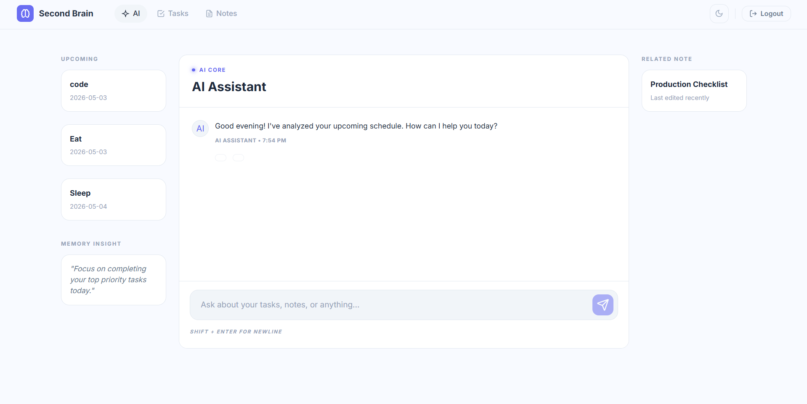
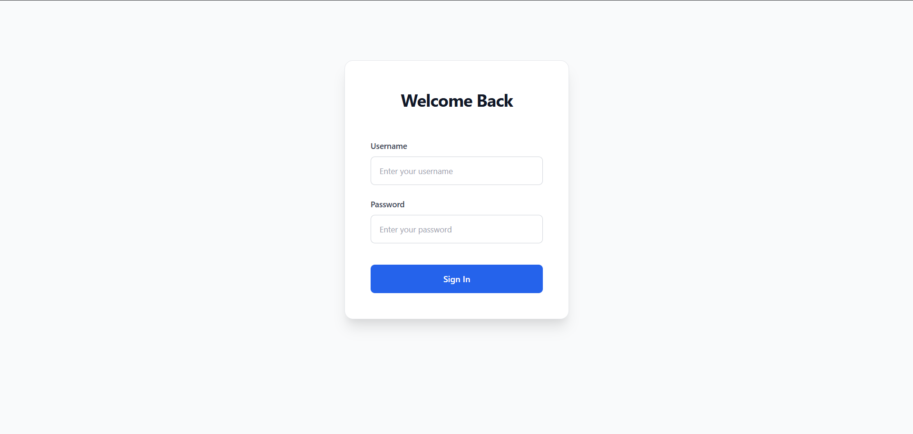
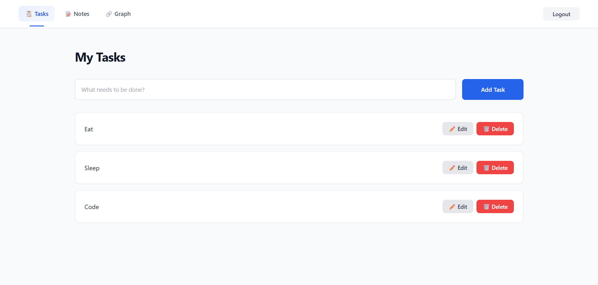
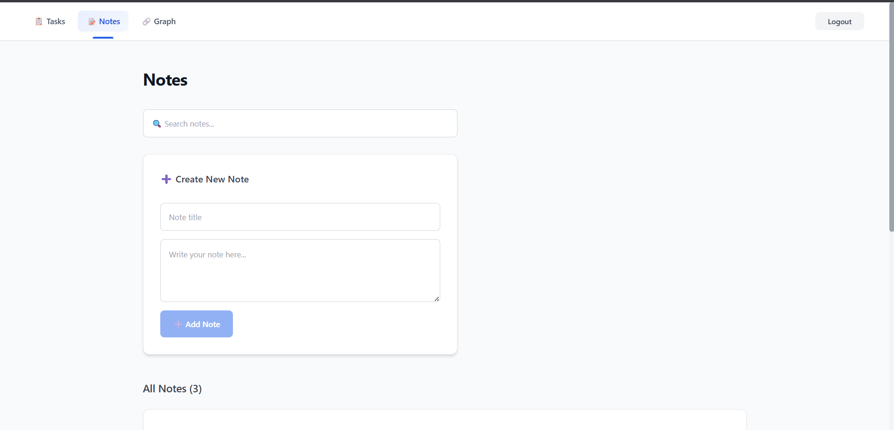
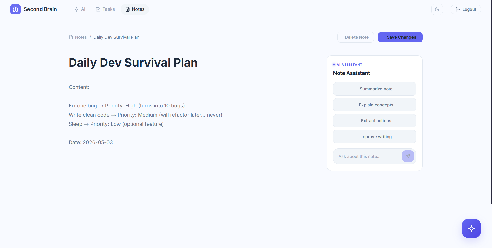
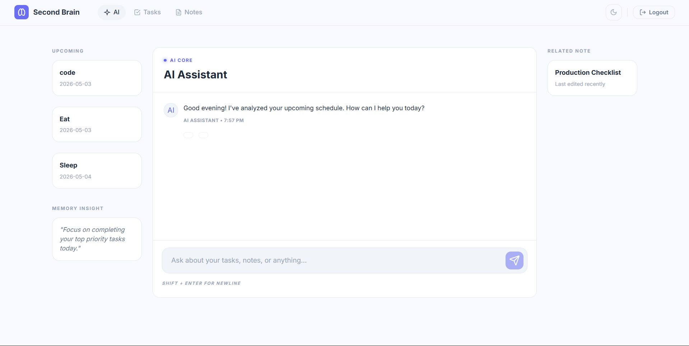
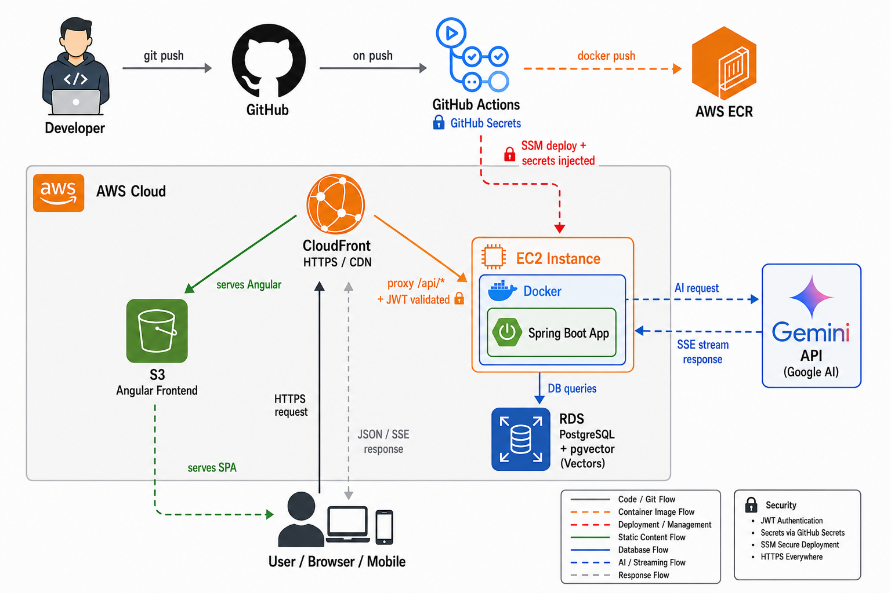

# 🧠 SecondBrain — Personal AI Life OS


> AI-powered personal productivity OS with RAG-based chat, task management, and semantic notes. Built with Angular, Spring Boot, PostgreSQL, and Google Gemini.

### 🌐 [Live Demo →  https://d3icm4v3pyidtw.cloudfront.net](https://d3icm4v3pyidtw.cloudfront.net)



---

## ✨ What is SecondBrain?

SecondBrain is a personal knowledge and task management system with a built-in AI reasoning layer. Instead of a simple chatbot, it uses **Retrieval-Augmented Generation (RAG)** to give the AI real context about your tasks and notes — so it can actually help you think, not just respond.

Ask it things like:
- *"What are my high priority tasks this week?"*
- *"Summarize my note about Project X"*
- *"Create a task to call John tomorrow at 5 PM"*

---

## 🚀 Features

### 🤖 AI Assistant (Gemini 2.5 Flash Lite)
- Real-time streaming responses via **Server-Sent Events (SSE)**
- **RAG pipeline** — AI reads your actual tasks and notes before answering
- **Decision Engine** — routes queries intelligently (AI / Hybrid / Direct DB)
- **Semantic search** using vector embeddings stored in PostgreSQL
- Persistent chat history that survives server restarts
- Agentic actions — AI can create tasks directly from chat (with confirmation)
- Time-aware greetings (Good morning / afternoon / evening / night)

### ✅ Task Management
- Create, edit, delete tasks
- Priority levels — Low / Medium / High with color badges
- Due dates with overdue highlighting
- Status lifecycle — Todo → In Progress → Done
- "Active today" count

### 📝 Knowledge Base (Notes)
- Rich note editor with title + content
- AI Assistant sidebar per note — Summarize, Explain, Extract actions, Improve writing
- Semantic search across all notes
- Auto-embedding on save for RAG retrieval

### 🔐 Authentication
- JWT-based auth with secure token storage
- Auto-login after registration
- Per-user data isolation — users only see their own data
- Rate limiting on auth endpoints

### 🎨 UI/UX
- Premium **Glassmorphism** dark theme
- Light / Dark mode toggle with OS preference detection
- Responsive layout (desktop + tablet)
- Real-time streaming text with typing cursor animation
- Suggested prompt chips for new users

---

## 🛠️ Tech Stack

| Layer | Technology |
|---|---|
| Frontend | Angular 12, TypeScript, Vanilla CSS |
| Backend | Spring Boot 3.4, Java 17 |
| Database | PostgreSQL (+ vector embeddings) |
| AI | Google Gemini 2.5 Flash Lite |
| Auth | JWT (JSON Web Tokens) |
| Streaming | Server-Sent Events (SSE) |
| Embeddings | Gemini Embedding API + DoubleListConverter |
| CI/CD | GitHub Actions, Docker, AWS ECR |
| Infrastructure | AWS (EC2, S3, CloudFront, RDS) |
| Build | Maven, Angular CLI |

---

## 📸 Screenshots

| Login | Tasks |
|---|---|
|  |  |

| Notes | Note Detail + AI |
|---|---|
|  |  |

| AI Chat | AI Task Creation |
|---|---|
|  |  |

---

## 🏗️ Project Structure

```
secondBrain/
├── backend/                          # Spring Boot application
│   └── src/main/java/com/example/backend/
│       ├── ai/                       # AI orchestration layer
│       │   ├── AiChatService.java    # Main AI pipeline
│       │   ├── DecisionEngineService.java  # Intent routing
│       │   ├── ContextBuilderService.java  # RAG context assembly
│       │   ├── GeminiService.java    # Gemini API client (SSE)
│       │   ├── EmbeddingService.java # Vector embeddings
│       │   ├── SafetyService.java    # Input sanitization
│       │   ├── SemanticCacheService.java   # Response caching
│       │   └── PromptBuilder.java    # System prompt construction
│       ├── controller/               # REST API endpoints
│       ├── service/                  # Business logic
│       ├── model/                    # JPA entities
│       ├── repository/               # Spring Data repositories
│       ├── security/                 # JWT auth + rate limiting
│       └── dto/                      # Data transfer objects
│
└── frontend/                         # Angular application
    └── src/app/
        ├── features/
        │   ├── ai-chat/              # AI chat page + streaming
        │   ├── tasks/                # Task management
        │   ├── notes/                # Notes list + detail editor
        │   └── auth/                 # Login + Register
        └── core/
            ├── guards/               # Auth route guards
            └── interceptors/         # JWT HTTP interceptor
```

---

## ☁️ Deployment Architecture

The application is deployed on **AWS (ap-south-1 — Mumbai)** with an automated CI/CD pipeline for the backend and manual deployment for the frontend.

🔗 **Live at:** [https://d3icm4v3pyidtw.cloudfront.net](https://d3icm4v3pyidtw.cloudfront.net)



### AWS Services Used

| Service | Region | Role |
|---|---|---|
| **S3** | ap-south-1 | Hosts the Angular SPA (static build files) |
| **CloudFront** | Global (Edge) | CDN — serves frontend over HTTPS, proxies `/api/*` requests to backend |
| **EC2** | ap-south-1 | Runs the Dockerized Spring Boot backend |
| **RDS (PostgreSQL)** | ap-south-1 | AWS-managed relational database with vector embedding storage |
| **ECR** | ap-south-1 | Private Docker image registry |
| **SSM** | ap-south-1 | Triggers container restart on deploy — no SSH required |

### Backend — CI/CD Pipeline (Automated)

1. **Developer** pushes code to `main` branch on GitHub
2. **GitHub Actions** automatically:
   - Sets up JDK 17 (Temurin)
   - Builds the Spring Boot JAR via Maven
   - Builds a **multi-stage Docker image** (Maven build → lightweight JRE runtime — keeps the final image small and secure)
   - Pushes the image to **AWS ECR**
   - Injects all secrets (Gemini API key, DB credentials, CORS origins) from **GitHub Secrets** — nothing hardcoded
3. **AWS SSM** sends a remote command to the EC2 instance to:
   - Pull the latest image from ECR
   - Stop and replace the running container
   - Start the new container with production environment variables
   - Prune old images to save disk space
4. **Spring Boot** (in Docker on EC2) handles business logic, JWT auth, and communicates with **RDS PostgreSQL** for data and **Google Gemini API** for AI

### Frontend — Manual Deployment

The Angular frontend is built locally and synced to S3:
```bash
cd frontend/secondbrain-frontend
ng build --configuration production
aws s3 sync dist/secondbrain-frontend s3://your-s3-bucket --delete
```
**CloudFront** then serves the SPA globally over HTTPS and routes `/api/*` to the EC2 backend origin.

### Docker Setup

The backend uses a **multi-stage Dockerfile** to keep the production image lean:

```dockerfile
# Build stage — full Maven + JDK
FROM maven:3.9.6-eclipse-temurin-17 AS build
WORKDIR /app
COPY . .
RUN mvn clean package -DskipTests

# Run stage — JRE only (no build tools)
FROM eclipse-temurin:17-jre
COPY --from=build /app/target/*.jar app.jar
ENTRYPOINT ["java", "-jar", "app.jar"]
```

This produces a minimal runtime image without Maven, source code, or build artifacts — reducing image size and attack surface.

> Automated deployment with minimal downtime — push to `main` and the backend is live in ~2 minutes.

---

## ⚙️ Getting Started

### Prerequisites
- Java 17+
- Node.js 18+
- PostgreSQL 14+
- Google Gemini API key ([Get one free here](https://aistudio.google.com/))

### 1. Clone the repo
```bash
git clone https://github.com/tanmayythakare/Smart-SecondBrain.git
cd secondbrain
```

### 2. Set up the database
```sql
CREATE DATABASE secondbrain_db;
CREATE USER secondbrain_user WITH PASSWORD 'your_password';
GRANT ALL PRIVILEGES ON DATABASE secondbrain_db TO secondbrain_user;
```

### 3. Configure the backend

Edit `backend/src/main/resources/application.properties` or set the equivalent environment variables:

```properties
spring.datasource.url=jdbc:postgresql://localhost:5432/secondbrain_db
spring.datasource.username=secondbrain_user
spring.datasource.password=your_password

jwt.secret=your_jwt_secret_key_here

app.ai.gemini.key=your_gemini_api_key_here
app.ai.gemini.model=gemini-2.5-flash-lite
app.ai.gemini.endpoint=https://generativelanguage.googleapis.com/v1beta/models/
```

#### Environment Variables Reference

| Variable | Required | Description |
|---|---|---|
| `spring.datasource.url` | ✅ | JDBC connection string for PostgreSQL |
| `spring.datasource.username` | ✅ | Database username |
| `spring.datasource.password` | ✅ | Database password |
| `jwt.secret` | ✅ | Secret key for signing JWT tokens (min 32 chars recommended) |
| `app.ai.gemini.key` | ✅ | Google Gemini API key |
| `app.ai.gemini.model` | ❌ | Gemini model name (default: `gemini-2.5-flash-lite`) |
| `app.ai.gemini.endpoint` | ❌ | Gemini API base URL (default: Google's public endpoint) |

> **⚠️ Never commit API keys or secrets to version control.** Use environment variables or a `.env` file excluded via `.gitignore`.

### 4. Run the backend
```bash
cd backend
./mvnw spring-boot:run
```
Backend runs on `http://localhost:8080`

### 5. Run the frontend
```bash
cd frontend/secondbrain-frontend
npm install
ng serve
```
Frontend runs on `http://localhost:4200`

### 6. Open the app
Visit `http://localhost:4200` — register an account and start using SecondBrain.

---

## 🔌 API Endpoints

| Method | Endpoint | Description |
|---|---|---|
| POST | `/api/auth/register` | Register new user |
| POST | `/api/auth/login` | Login, returns JWT |
| GET | `/api/tasks` | Get all tasks |
| POST | `/api/tasks` | Create task |
| PUT | `/api/tasks/{id}` | Update task |
| DELETE | `/api/tasks/{id}` | Delete task |
| GET | `/api/notes` | Get all notes |
| POST | `/api/notes` | Create note |
| PUT | `/api/notes/{id}` | Update note |
| DELETE | `/api/notes/{id}` | Delete note |
| GET | `/api/notes/search?q=` | Semantic search notes |
| POST | `/api/ai/chat/stream` | AI chat (SSE stream) |
| GET | `/api/ai/chat/history` | Get chat history |
| POST | `/api/ai/chat/confirm` | Execute agentic action |

> All endpoints except `/api/auth/**` require a valid JWT in the `Authorization: Bearer <token>` header.

---

## 🧠 How the AI Works

```
User Message
     │
     ▼
SafetyService ──── (blocks harmful input)
     │
     ▼
DecisionEngine ─── (AI / Hybrid / Direct DB / Action)
     │
     ├── NON_AI ──► Direct DB query → instant response
     │
     ├── ACTION ──► Extract payload → Confirm button → Execute
     │
     └── AI/HYBRID ──► ContextBuilder (RAG)
                              │
                        ┌─────┴──────┐
                     Recent      Semantic
                     Items       Search
                        └─────┬──────┘
                              │
                         PromptBuilder
                              │
                         GeminiService
                         (SSE Stream)
                              │
                         Frontend renders
                         token by token
```

**Key concepts:**
- **Decision Engine** classifies each user message into one of four routes — avoiding unnecessary AI calls for simple queries
- **RAG (Retrieval-Augmented Generation)** pulls relevant tasks and notes into the prompt context so the AI has real, personal data to reason about
- **Agentic Actions** let the AI propose creating tasks, with a confirmation step before execution — keeping the user in control
- **SSE Streaming** delivers tokens in real-time for a responsive, ChatGPT-like experience

---

## 🔒 Security

- All endpoints (except `/api/auth/**`) require a valid JWT
- Passwords hashed with BCrypt
- Rate limiting on auth and AI endpoints
- Input sanitization before AI processing
- Per-user data isolation enforced at service layer
- Environment variables for all secrets — no hardcoded keys in source code
- CORS configured for frontend origin only

---

## ❓ Troubleshooting

<details>
<summary><strong>CORS errors in browser</strong></summary>

Ensure the backend's CORS configuration allows your frontend origin (`http://localhost:4200` for local dev). The `SecurityConfig.java` permits OPTIONS preflight requests — if you've changed ports, update accordingly.
</details>

<details>
<summary><strong>AI chat returns errors or empty responses</strong></summary>

1. Verify your `app.ai.gemini.key` is valid at [Google AI Studio](https://aistudio.google.com/)
2. Check backend logs for `403` or `429` (quota exceeded) responses from the Gemini API
3. Ensure the model name in config matches an available model
</details>

<details>
<summary><strong>Frontend 404 on page refresh (production)</strong></summary>

The Angular app uses client-side routing. In production (S3/CloudFront), configure the error document to redirect to `index.html`. For hash-based routing, the app already uses `useHash: true`.
</details>

<details>
<summary><strong>Database connection refused</strong></summary>

1. Confirm PostgreSQL is running: `pg_isready -h localhost -p 5432`
2. Verify the database and user exist with the credentials in your config
3. Check that `pg_hba.conf` allows local connections
</details>

---

## 🚧 Future Improvements

Things I'm planning to add next:

- [ ] 📱 Progressive Web App (PWA) support for mobile
- [ ] 🎙️ Voice input for AI chat
- [ ] 🏷️ Tags and categories for tasks and notes
- [ ] 📊 Dashboard with productivity analytics
- [ ] 🔗 Multi-model support (GPT-4o, Claude, Llama)
- [ ] 📤 Export notes as PDF / Markdown
- [ ] 🔔 Push notifications for due tasks
- [ ] 🐳 Docker Compose for one-command local setup
- [ ] 🧪 Unit and integration test coverage
- [ ] 🌐 Automated frontend CI/CD via GitHub Actions

---

## 📋 What I Learned Building This

This project was built to learn and demonstrate:

- **Full-stack development** with Angular + Spring Boot
- **AI integration** — not just calling an API, but building a proper RAG pipeline
- **Streaming UIs** — Server-Sent Events for real-time token streaming
- **Vector embeddings** — storing and querying semantic vectors in PostgreSQL
- **JWT authentication** — stateless auth with Spring Security
- **Cloud deployment** — Dockerized backend on EC2, Angular SPA on S3 + CloudFront
- **CI/CD pipelines** — GitHub Actions for automated build, test, and deploy
- **Production practices** — error handling, rate limiting, data isolation, environment config

---

## 🤝 Contributing

Contributions are welcome! If you'd like to improve SecondBrain:

1. Fork the repository
2. Create a feature branch (`git checkout -b feature/amazing-feature`)
3. Commit your changes (`git commit -m 'Add amazing feature'`)
4. Push to the branch (`git push origin feature/amazing-feature`)
5. Open a Pull Request

---

## 👤 Author

**Tanmay Thakare**
- GitHub: [@tanmayythakare](https://github.com/tanmayythakare)

---

## 📄 License

This project is open source and available under the [MIT License](LICENSE).

---

<p align="center">Built with ☕ and a lot of debugging</p>