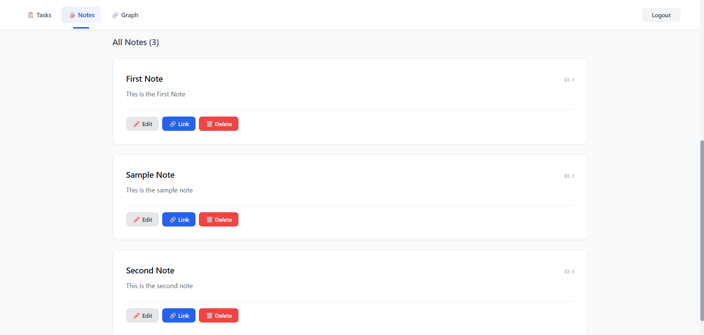
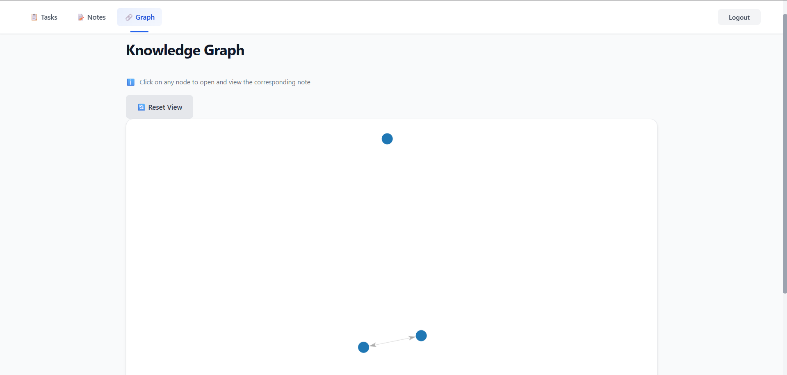

# 🧠 Life OS — Personal Productivity & Knowledge Management

> A full-stack web application to manage your tasks, notes, and ideas — with an interactive knowledge graph to visualize connections between your thoughts.

---

## 📖 Description

**Life OS** is a personal productivity platform designed to help you organize your work, capture ideas, and discover connections between them. Whether you're tracking daily tasks, writing notes, or mapping how your ideas relate to each other, Life OS keeps everything in one place.

The app is built for developers and knowledge workers who want a system that's fast, clean, and actually useful — without the bloat of traditional note-taking tools.

**Why does it exist?**
Most productivity apps treat tasks and notes as isolated silos. Life OS connects them — you can link any note to another, and the knowledge graph shows you the bigger picture of your thinking. It's a second brain you can actually navigate.

---

## ✨ Features

- 🔐 **User Authentication** — Secure registration and login with JWT tokens
- ✅ **Task Management** — Create, edit, and delete tasks with inline editing and delete confirmation
- 📝 **Notes System** — Write and manage notes with full-text search across title and content
- 🔗 **Note Linking** — Link notes to each other and explore backlinks
- 🕸️ **Knowledge Graph** — An interactive force-directed graph to visually explore how your notes connect
- 👥 **Multi-User Support** — Each user's data is fully isolated from others
- 🔍 **Search** — Filter notes instantly by title or content
- 📱 **Responsive Design** — Works on desktop and mobile

---

## 🛠️ Tech Stack

### Backend
| Technology | Purpose |
|---|---|
| Java 17 | Programming language |
| Spring Boot 4.0.2 | Backend framework |
| Spring Security | Authentication & authorization |
| Spring Data JPA | Database access layer |
| PostgreSQL | Primary database |
| JWT (jjwt 0.11.5) | Secure token-based authentication |
| SpringDoc OpenAPI 2.3.0 | API documentation (Swagger UI) |
| Lombok | Boilerplate reduction |
| Maven | Build tool |

### Frontend
| Technology | Purpose |
|---|---|
| Angular 12 | Frontend framework |
| TypeScript | Programming language |
| Custom CSS | Styling (CSS variables, responsive) |
| force-graph | Interactive knowledge graph visualization |

---

## 📋 Prerequisites

Before you begin, make sure you have the following installed on your computer:

- [Java 17+](https://adoptium.net/) — Download and install JDK 17 or higher
- [Node.js 16+](https://nodejs.org/) — Includes npm (needed for Angular)
- [PostgreSQL 14+](https://www.postgresql.org/download/) — The database
- [Git](https://git-scm.com/) — To clone the project
- A code editor like [VS Code](https://code.visualstudio.com/) (recommended)

---

## 🚀 Installation & Setup

### Step 1 — Clone the Repository

```bash
git clone https://github.com/justTanmay/secondbrain.git
cd secondbrain
```

---

### Step 2 — Set Up the Database

1. Open your PostgreSQL client (e.g., pgAdmin or the terminal).
2. Create a new database and user:

```sql
CREATE DATABASE secondbrain_db;
CREATE USER secondbrain_user WITH PASSWORD 'secondbrain';
GRANT ALL PRIVILEGES ON DATABASE secondbrain_db TO secondbrain_user;
```

> Spring Boot with `ddl-auto=update` will automatically create all tables when the backend starts — you don't need to create them manually!

---

### Step 3 — Configure the Backend

1. Navigate to the backend folder:

```bash
cd backend
```

2. Open the configuration file:

```
src/main/resources/application.properties
```

3. The default values are already set to match the database you created above:

```properties
spring.datasource.url=jdbc:postgresql://localhost:5432/secondbrain_db
spring.datasource.username=secondbrain_user
spring.datasource.password=secondbrain
spring.jpa.hibernate.ddl-auto=update
jwt.secret=secondbrain-secret-key-which-is-very-secure
```

> ⚠️ **For production**, never use these default values. Override them with environment variables and activate the `prod` profile.

---

### Step 4 — Run the Backend

From inside the `backend` folder, run:

```bash
# On Mac/Linux
./mvnw spring-boot:run

# On Windows
mvnw.cmd spring-boot:run
```

You should see the server start on **http://localhost:8080**

Swagger UI (interactive API docs): **http://localhost:8080/swagger-ui.html**

> The first run will take a few minutes as Maven downloads all dependencies.

---

### Step 5 — Run the Frontend

Open a **new terminal** and navigate to the frontend folder:

```bash
cd frontend/secondbrain-frontend
```

Install dependencies (first time only):

```bash
npm install
```

Start the development server:

```bash
npm start
```

The app will open at **http://localhost:4200** 🎉

---

## 🖥️ Usage

1. **Login** — Go to `http://localhost:4200` and sign in. (Registration is handled directly via the API for now — see the API section below.)

2. **Manage Tasks** — Click **Tasks** in the top nav to create, edit, and delete your tasks.

3. **Write Notes** — Click **Notes** in the top nav to create notes. Use the search bar to find notes by title or content.

4. **Link Notes** — On any note card, click **Link** to connect it to another note using its ID.

5. **Explore the Graph** — Click **Graph** in the top nav to open the knowledge graph. Each node is a note; arrows show connections. Click a node to open that note.

---

## 📁 Folder Structure

```
secondbrain/
│
├── backend/                         # Spring Boot backend
│   ├── Dockerfile                   # Multi-stage production Docker build
│   ├── pom.xml                      # Maven dependencies
│   └── src/main/java/com/example/backend/
│       ├── controller/              # REST API endpoints
│       │   ├── AuthController.java
│       │   ├── TaskController.java
│       │   ├── NoteController.java
│       │   └── NoteLinkController.java
│       ├── service/                 # Business logic
│       ├── repository/              # Database queries (JPA)
│       ├── model/                   # Database entity models
│       ├── dto/                     # Data transfer objects
│       ├── security/                # JWT filter, util, and SecurityConfig
│       ├── exception/               # Global error handling
│       └── config/                  # OpenAPI / Swagger configuration
│   └── src/main/resources/
│       ├── application.properties   # Default (local) configuration
│       └── application-prod.properties  # Production configuration
│
└── frontend/secondbrain-frontend/   # Angular frontend
    └── src/app/
        ├── core/                    # Guards and HTTP interceptors
        │   ├── guards/              # AuthGuard (route protection)
        │   └── interceptors/        # JwtInterceptor (auto-attach token)
        ├── features/                # Pages and feature modules
        │   ├── auth/                # Login component & AuthService
        │   ├── tasks/               # Task list component & TaskService
        │   └── notes/               # Note list, note graph & NoteService
        └── environments/            # API URL configuration (local / prod)
```

---

## 📸 Screenshots

> _Screenshots coming soon!_

| Page | Preview |
|---|---|
| Login |  |
| Tasks |  |
| Notes |  |
| Notes |  |
| Knowledge Graph |  |

---

## 🔌 API Overview

The backend exposes a REST API. All endpoints except auth require an `Authorization: Bearer <token>` header.

| Method | Endpoint | Description |
|---|---|---|
| POST | `/api/auth/register` | Register a new user |
| POST | `/api/auth/login` | Login and receive a JWT token |
| GET | `/api/tasks` | Get all tasks for the current user |
| POST | `/api/tasks` | Create a new task |
| PUT | `/api/tasks/{id}` | Update a task |
| DELETE | `/api/tasks/{id}` | Delete a task |
| GET | `/api/notes` | Get all notes for the current user |
| POST | `/api/notes` | Create a new note |
| PUT | `/api/notes/{id}` | Update a note |
| DELETE | `/api/notes/{id}` | Delete a note |
| GET | `/api/notes/search?q={query}` | Full-text search across notes |
| POST | `/api/note-links?sourceId=X&targetId=Y` | Link two notes |
| GET | `/api/note-links/{noteId}` | Get notes linked from this note |
| GET | `/api/note-links/backlinks/{noteId}` | Get notes that link to this note |

> Full interactive docs available at: **http://localhost:8080/swagger-ui.html**

---

## 🔮 Future Improvements

Here are some features planned for future versions:

- [ ] 📝 Registration page in the UI (currently API-only)
- [ ] 🌙 Dark mode support
- [ ] 🏷️ Tags and categories for notes and tasks
- [ ] 📅 Task due dates and priority levels in the UI
- [ ] 🔁 Recurring tasks support
- [ ] 📤 Export notes as Markdown or PDF
- [ ] 🔔 Notifications and reminders
- [ ] 📊 Analytics dashboard (task completion trends, note activity)

---

## 🤝 Contributing

Contributions are welcome! Here's how to get started:

1. **Fork** the repository on GitHub
2. **Clone** your fork locally:
   ```bash
   git clone https://github.com/your-username/secondbrain.git
   ```
3. **Create a new branch** for your feature:
   ```bash
   git checkout -b feature/your-feature-name
   ```
4. **Make your changes** and commit them:
   ```bash
   git commit -m "Add: description of your change"
   ```
5. **Push** to your fork:
   ```bash
   git push origin feature/your-feature-name
   ```
6. Open a **Pull Request** on GitHub

### Guidelines
- Follow the existing code style
- Write clear commit messages
- Test your changes before submitting
- Keep pull requests focused on one feature or fix

---

## 🐛 Known Issues / Troubleshooting

**"Cannot connect to server" on login**
→ Make sure the backend is running on port 8080 and PostgreSQL is running.

**"Access Denied" errors after a while**
→ Your JWT token has expired (24-hour expiry). Log out and log back in.

**Build fails with Java version error**
→ Make sure you have Java 17 or higher installed. Run `java -version` to check.

**npm install fails**
→ Try deleting the `node_modules` folder and running `npm install` again.

**Knowledge graph is empty**
→ You need to create at least two notes and link them together before the graph will show connections.

---

## 📄 License

This project is licensed under the **MIT License** — see the [LICENSE](LICENSE) file for details.

You are free to use, modify, and distribute this project for personal or commercial use.

---

## 👤 Author

**Tanmay Thakare**

- GitHub: [@justTanmay](https://github.com/justTanmay)
- LinkedIn: [linkedin.com/in/tanmaythakare](https://www.linkedin.com/in/tanmaythakare/)
- Email: tanmayrthakare@gmail.com

---

<div align="center">

Made with ❤️ and ☕ | If you find this project useful, please ⭐ star the repository!

</div>
